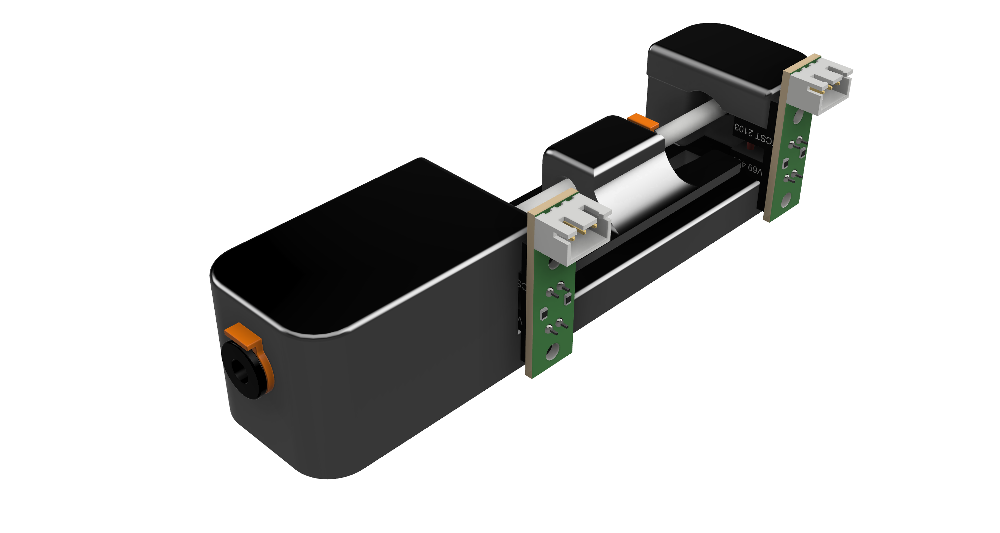
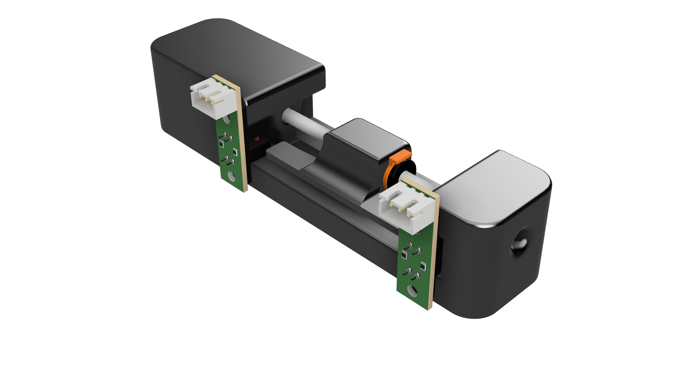
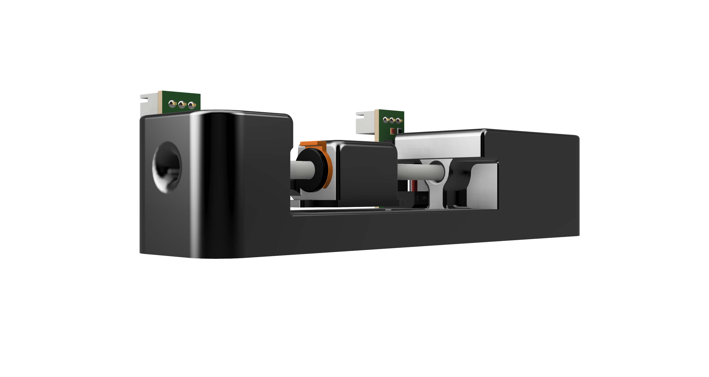
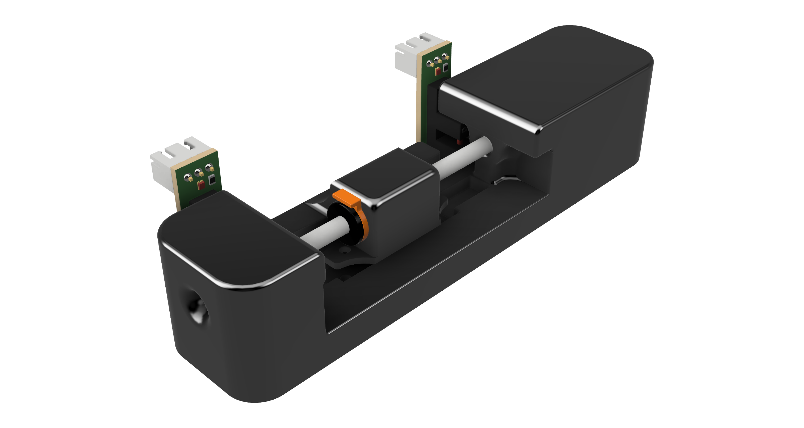
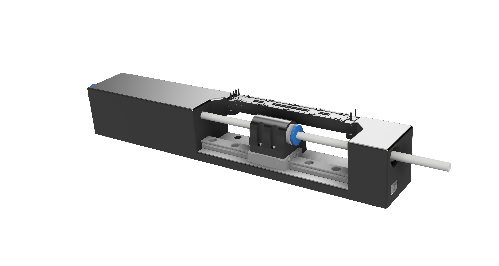
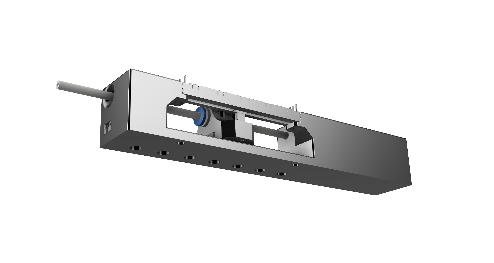
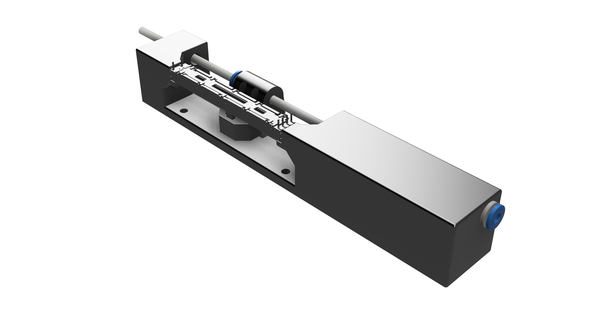
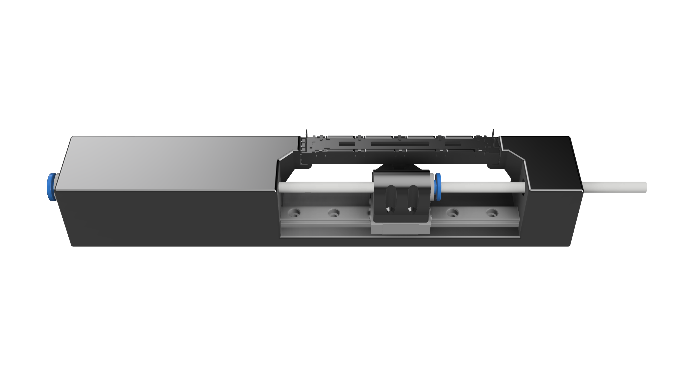

# Pictures

This folder contains all images, diagrams, and renderings related to the **Belay Variants** project.

### Dual Sensor Variant

  
  

  
  

### Potentiometer Variant

  
  

  
  

